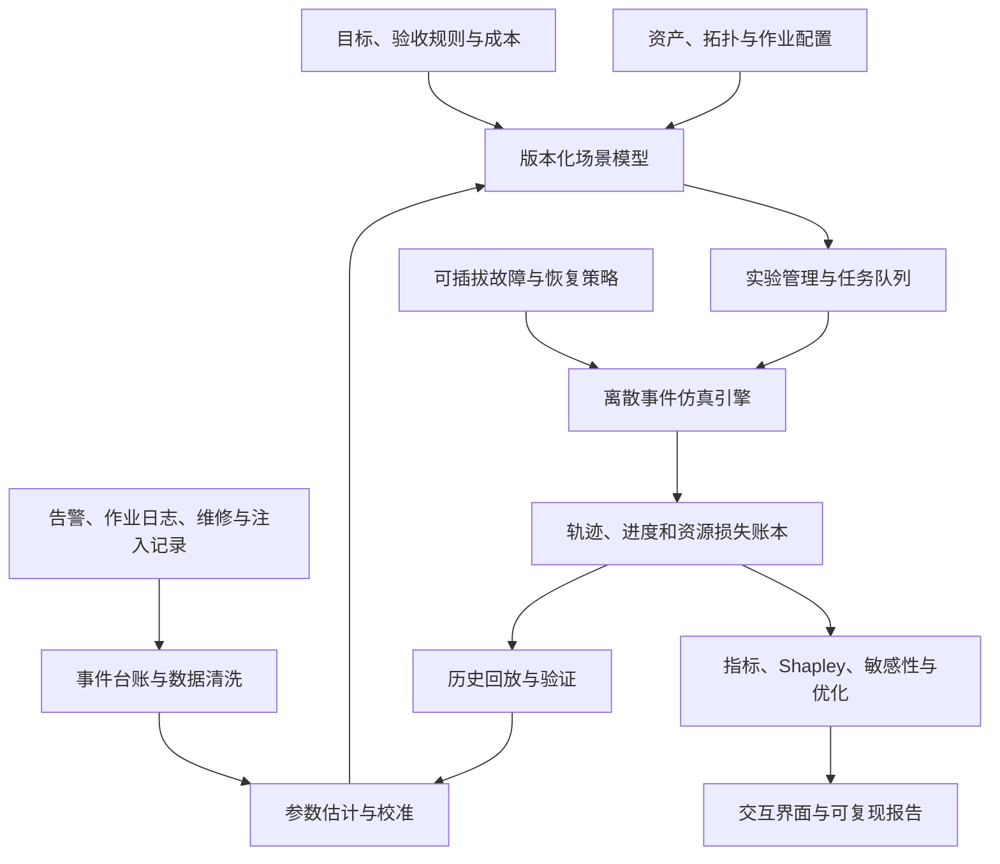

# 可靠性评估系统架构评审与演进建议

评审范围：2026-09-23 的月度训练模型 V3、Shapley 分析程序及交互 HTML。以大规模训练集群为主；推理服务的请求延迟、在线服务 SLA 应使用独立工作负载与指标模块。此次为架构评审，没有修改现有计算结果。

## 1. 当前系统能做什么，尚不能做什么

当前已具备离散事件仿真、三类故障、全局/50 域局部恢复、检查点回退、静默污染与交付判废、规模扫描、Shapley 归因、离线重算及确定性测试。适合回答：在给定假设下，哪些改进组合更有价值。

目前尚未形成真实运行数据校准、拓扑与工作负载映射、恢复能力验证、模型外推检查的闭环。因此五十万卡 95.34% 是当前输入与策略假设下的情景估计，不是实测生产可靠性或上线保证。组合枚举准确、贡献加和正确，都不能替代这些环节。

## 2. 最优先补齐的能力

| 优先级 | 能力 | 当前缺口 | 应达到的结果 |
|---|---|---|---|
| P0 | 指标与版本契约 | 运行可用度、有效进度、正确交付易混淆；多版 HTML 与引擎并存 | 每个结果绑定指标定义、模型/策略版本、输入快照、数据版本、随机种子与置信口径 |
| P0 | 真实故障与恢复台账 | 主要依赖假设参数、总 FIT 和固定类型比例 | 事件按根因去重，关联作业与设备暴露小时，记录发生到正确恢复的完整时间线 |
| P0 | 硬件拓扑与作业映射 | 总 FIT 相加，固定 50 域；没有组件依赖、真实通信组和共同故障 | 能推导某设备/链路/机柜故障影响哪些 rank、并行组、恢复域和作业 |
| P0 | 恢复能力与正确性模型 | step 状态默认可用；定位干净检查点和恢复成功均为假设 | 检出、定位、隔离、干净状态验证、加载、重算、重新加入分别可验证 |
| P1 | 共享资源与恢复排队 | 修复时间独立，未考虑人员、备件、带宽等资源争用 | 相同故障在轻载与故障风暴下产生不同恢复时间 |
| P1 | 概率分布与不确定性 | 以均值/固定延迟为主，区间主要反映 Monte Carlo 误差 | 输出月度产出分布、截止时间达标概率、参数不确定性和排名稳健性 |
| P1 | 实验管理与计算服务 | HTML 嵌入代码和结果，命令行可跑，但缺少统一实验记录 | 场景可保存、比较、复现，长任务可取消/恢复，报告可追溯 |
| P2 | 成本约束下优化 | Shapley 分配产出收益，不含建设/运行成本及方案依赖 | 能回答预算下选什么方案、达到目标需要什么最小配置 |
| P2 | 多作业集群模型 | 当前单作业卡数等于集群卡数 | 区分总卡、作业卡、备用卡、排队资源；评估共享资源和集群整体产出 |

## 3. 模型架构：组件故障、表现与影响范围应拆开

当前 `月度训练仿真引擎.js` 约第 56–58 行将总卡数乘以 FIT 合计，再按统一概率分成中断、亚健康和静默。这保留了规模规律，但设备类型之间的区别在求和后消失。

下一版建议采用三层映射：

1. **组件与故障模式**：HBM 可纠正/不可纠正错误、加速卡、板卡、CPU、NIC、交换机、链路、存储、供电、制冷、驱动、通信库、调度器等。硬件来源与软件来源分别记录。
2. **外在表现**：中断、降速、静默污染，或被硬件纠正后没有作业影响。不是每条 ECC 记录都意味着一次作业中断。
3. **影响范围**：单卡、服务器、TP/PP/DP 组、超节点/互联域、机柜、供电域、存储域或整个作业。

独立事件来源的发生率可表示为 `Σ(组件数量 × 单组件 FIT / 10^9)`，共同原因故障另建事件源；最终作业影响通过依赖关系和恢复策略计算。供应商 FIT、现场事件 FIT 和“导致作业中断的等效 FIT”必须区分，避免重复计数。

建议保存一张机器可读的依赖图，并提供 RBD/故障树视图。RBD 适合解释串并联与冗余关系；动态暂停、污染传播、修复队列和进度回退仍交给离散事件引擎。架构图中的组件、冗余和连接必须能够改变计算结果，不能只作为说明图片。

工作负载模型需要记录模型规模、step 时间分布、checkpoint 大小、DP/TP/PP/CP 等并行配置、rank 放置、网络通信组及恢复域。固定域数量与固定域大小是不同扩容策略，应分别比较。

## 4. 弹性收益需要真实吞吐和恢复约束

当前局部模式基本按活跃域比例折算吞吐，缺少同步重组、通信慢节点、状态加载、数据重分片和资源不足的影响。应增加：

- 发生故障到隔离期间是否全作业停顿、停多久。
- 重建通信组、同步状态、追赶进度、重新加入的时间。
- 可运行的最少域数、允许同时丢失的域数、备机数量及耗尽后的行为。
- DP 缩小时全局 batch 如何保持，是否增加梯度累积，以及达到同一训练质量所需的实际工作量。
- 性能映射 `吞吐 = f(活跃域、网络、并行配置、状态)`，从测量拟合，而非始终线性按卡数折算。

恢复建模应区分“作业恢复服务时间”与“坏设备维修时间”。有备机时任务可能迅速恢复，但后台硬件维修仍持续占用备件与人力。五十万卡场景的同时故障、故障风暴和恢复资源争用应显式排队。

## 5. 静默检测和正确恢复必须分开

建议将当前一条“检出后恢复”的路径分为：错误触发 → 是否产生有害污染 → 检测 → 定位 → 隔离故障源 → 验证恢复状态 → 回退/重算 → 正确性验证 → 重新加入。

保留用户当前“未恢复污染导致交付为零”的验收规则，但将其显式配置。未来若评估容错算法，可增加污染严重度与质量验收模型。真实 SDC 研究观察到了不同节点、计算环节与训练阶段的不同影响，不能自动把全部硬件异常视为同一种污染过程。[Understanding Silent Data Corruption in LLM Training](https://aclanthology.org/2025.acl-long.996/)。

当前模拟器知道真正的污染时刻，并保存了污染前的干净状态。这是计算真值所需的信息；实际恢复策略不应直接读取这些隐藏信息，而应通过检测/定位模块得到观测结果。需分别建模检出率、定位成功率、干净状态确认率、恢复成功率，以及误报导致的额外停顿。

尤其应检查两个具体边界：

1. `silentDetection()` 把恢复点直接赋给普通 checkpoint 状态。若 step 重放依赖的只是 HBM/内存快照，它未必能在后续整机故障后恢复。应将 **step 重放状态、持久化 checkpoint、经过校验的干净 checkpoint** 分成不同对象，并记录存储层级与故障域。
2. 如果根因是持续失效的 GPU/HBM，重算同一 step 可能再次出错。应区分瞬态错误与持续硬件故障，后者可能需要隔离/换卡；不能默认每次重算都清除了故障源。

永久保留不等于零成本或永久可访问。需要 checkpoint 大小、写入/读取带宽、容量、副本位置、校验开销及存储故障。MLCommons 已把 checkpoint 保存与恢复作为独立的存储评测负载，这也是本系统应当单独建模的原因。[MLPerf Storage checkpointing workload](https://mlcommons.org/2025/08/storage-2-checkpointing/)。

## 6. 输出应从一条均值曲线扩展为指标组

| 指标 | 回答的问题 |
|---|---|
| 容量加权资源可用度 | 整个周期内真正可用的卡时占多少？ |
| 训练推进效率 | 扣除保存、降速、暂停与重算后，推进了多少净进度？ |
| 正确交付产出率 | 到周期末，最终可交付多少正确净进度？保留现有主指标 |
| 期限内正确完成概率 | 给定工作量/目标 tokens，能否在一个月内完成并通过验收？ |
| 完工时间分布 | P50/P95 多久完成；未完成任务单独统计，不从样本中消失 |
| 正确结果风险 | 周期末仍有未识别污染的概率、最大污染暴露时间等 |
| 资源与成本 | 浪费卡时、备用卡、人力与存储开销、单位正确产出的成本 |

固定 30 天的产出比例，与完成固定工作量所需时间，是不同评估模式。原始 TOR 论文以理想训练时间与实际训练时间之比定义指标，不能不加条件地与本系统的有限窗口交付比率互换。[Training Overhead Ratio](https://arxiv.org/abs/2408.07482)。

月度结果分布、均值估计的置信区间、输入参数的不确定区间必须分开展示。当前图中的 Monte Carlo 均值区间不表示“95% 的月份都会落在其中”。

## 7. 数据校准与验证闭环

最小事件台账应包含：事件 ID/根因 ID、设备和故障域、关联作业/rank、硬件/驱动/软件版本、运行负载与暴露小时、首次异常/发现/定位/隔离/开始恢复/恢复完成/验证通过时间、丢失进度、恢复方法及最终结果。静默发生时间无法精确获知时，应保存可能区间及证据，不伪造精确标签。

同一网络故障可能触发几千条 rank 日志，必须先去重为一个根因事件，再计算事件率。设备 FIT 用该类设备暴露小时作分母；作业中断率用作业运行小时作分母。设备型号、批次、年龄、负载和版本不同，应分层统计。

“万卡 30 小时中断一次”只能约束汇总中断率，不能唯一推导每种部件 FIT。行业故障占比也不能直接替代本集群设备 FIT。应区分用户假设、外部参考、实测估计和未识别参数；保留来源、样本量、适用范围和版本。

验证至少有四层：

1. 确定性时间线与数学极限测试，确认实现没有算错。
2. 解析特例与事件模拟交叉检查。
3. 用历史事件时间线回放，检查停顿、回退、实际吞吐和最终结果。
4. 在未参与参数拟合的时间段/集群上验证预测，并报告误差与有效外推范围。

公开的 ML 集群可靠性研究使用真实作业与 GPU 小时数据拟合规模相关失效率；可以借鉴其故障分类、暴露口径和参数校准方法，不直接照搬到不同硬件集群。[Revisiting Reliability in Large-Scale Machine Learning Research Clusters](https://arxiv.org/abs/2410.21680)。

故障注入要覆盖单卡故障、链路/交换机故障、多个域同时失效、持续亚健康、静默注入、脏 checkpoint、备机耗尽和恢复中再次故障。运行次数增加只能减少采样误差，不能消除模型偏差。

## 8. 建议的软件架构

初期采用模块化单体即可：统一模型包、一个计算服务、多进程计算 worker、实验数据库与结果文件存储。前端负责输入与展示；正式实验在可追踪的后台任务中执行。保留离线 HTML 作为导出格式。

当前不同版本引擎和 HTML 内嵌代码需要统一来源，避免修正了公式但页面仍使用旧副本。页面计算与命令行计算从同一模型包构建。报告显示模型版本、参数数据版本、指标定义、策略版本、随机种子、采样量与校验结果。

故障真值状态与监控可观测状态分离。故障过程描述世界发生了什么，检测策略只接收其能看到的观测；恢复策略不能直接访问故障真值。资源与进度账本统一记录暂停、降速、回退、重算和正确交付，避免多个损失项重复扣除。

联合采样可按物理事件源、检测过程和维修过程拆分随机流，提高跨策略比较的可解释性。大规模情况下按同质组件/故障域聚合，不必逐步模拟五十万张卡的每个 training step。

Shapley 保留为分析模块。方向增多时可用排列采样并报告归因误差；有前置依赖的改进先定义可行组合或分组归因，避免评估工程上无法实施的组合。目标幅度和成本必须一起显示。

## 9. 建议按可验收的三步推进

**第一步：统一可信的模型基础。** 完成指标字典、场景 schema、参数来源和版本、单一模型构建链、统一损失账本；修正 step 状态与持久化 checkpoint 边界。验收标准是同一场景在命令行与页面结果一致、确定性事件损失可逐项核对、任意报告可复现。

**第二步：让拓扑和策略真正参与计算。** 接入一套真实硬件/网络/并行组映射，增加共同故障、恢复资源与队列，标定局部容错吞吐和静默恢复链路。验收标准是同样总 FIT、不同拓扑与备机策略能产生有依据的差异，并能解释真实故障回放。

**第三步：形成架构决策平台。** 支持固定工作量完工评估、风险分布、成本约束、稳健性分析及多作业扩展。验收标准是给定目标（例如一个月内正确完成的概率与预算），能比较可行方案、给出不确定范围和证据，而不只输出一条平均可用度曲线。

最值得优先获取的四类实测输入：根因去重后的事件台账、step/checkpoint/通信性能剖析、局部恢复实测时间线、静默检测与干净状态恢复的注入验证结果。
